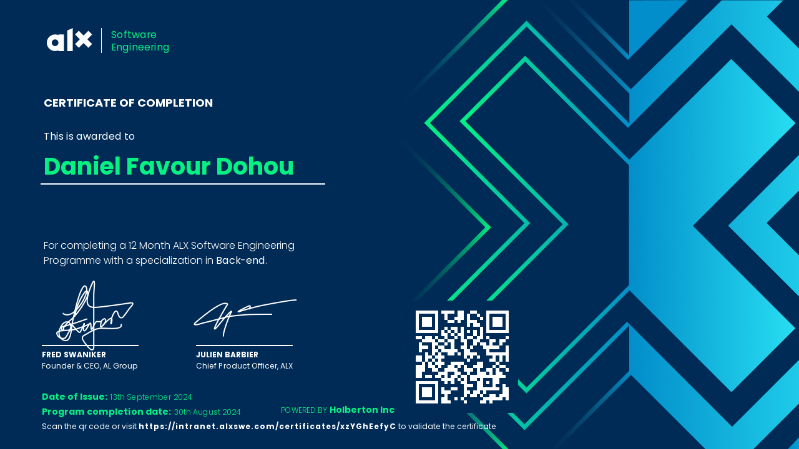
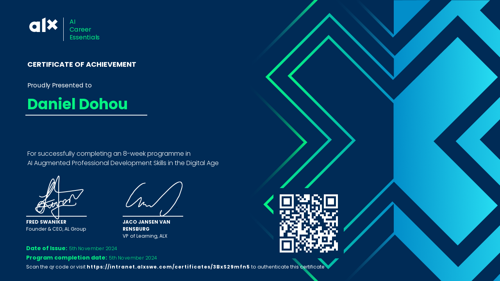

- 🔥 Hi, I am <strong>Dohou Daniel Favour</strong> (Check me out on Twitter: <strong><a href="https://github.com/dohoudaniel/">@dohoudaniel</a></strong>).
- ✨ <strong>I’m interested in building Software Engineering projects, Open Source, and being a Google Developer Expert.</strong>
- 👨‍💻 I am an <strong>ALX Certified Software Engineer</strong> (Check out my Consistency Journey here: <strong><a href="https://twitter.com/search?q=%23365daysofsoftwareengineering&src=hashtag_click">#365DaysOfSoftwareEngineering</a></strong>).
- 🌟 I'm a <strong><a href="https://twitter.com/facesofalxse/status/1704408871542854002?s=20">Face of ALX SE</a></strong>.
- ✍ I am a <strong>Technical Writer</strong>
- 👨‍💻 I am <strong>looking to collaborate on and build ground-breaking projects</strong>.
 
<h2 align="center">My Certifications</h2>

  <h4 align="center">Completion Of The ALX SE Program</h4>
  

   
  <h4 align="center">Completion Of The ALX AiCE Program</h4>
  

   
  <h4 align="center">Completion Of The ALX Founders Academy Program</h4>
  

  <!--
   
  <h4 align="center">Completion Of The ALX ProDev Program</h4>
  
  -->
  

 
<h2 align="center">What I Worked On & I'm Currently Working On</h2>
<ul>
  <li><strong><a href="https://github.com/ALX-SE-Algorithmia">Algorithmia SE 🌍</a></strong></li>
  <li><strong><a href="https://twitter.com/Learnopolia">Learnopolia 🐢</a></strong> (<a href="https://learnopolia.onrender.com">Website</a> |<!-- https://learnopolia.github.io --> <a href="https://github.com/learnopolia/">GitHub Org.</a>)</li>
  <li><strong><a href="https://a-green-bot.github.io/">A Green Bot ♻</a></strong> (<a href="https://a-green-bot.github.io/">Website</a> | <a href="https://github.com/A-Green-Bot">GitHub Org.</a>)</li>
</ul>
 
<h2 align="center">Some Of My Published Technical Blogs</h2>
<ul>
  <li><strong><a href="https://studentsofalxse.hashnode.dev/julien-barbier-building-a-startup-as-an-swe">Building A Startup As A Software Engineer: Insights from an X (Twitter) Space With Julien Barbier (#ALX_SE)</a></strong></li>
  <li><strong><a href="https://studentsofalxse.hashnode.dev/julien-barbier-alxse-building-side-projects">Building Side Projects: The Secret to Long-Term Success in Tech (Julien Barbier)</a></strong></li>
  <li><strong><a href="https://dohoudanielfavour.hashnode.dev/a-yearlong-odyssey-365daysofsoftwareengineering">A Yearlong Odyssey: #365DaysOfSoftwareEngineering</a></strong></li>
  <li><strong><a href="https://medium.com/@dohoudanielfavour/what-happens-when-you-type-www-google-com-in-your-web-browser-and-press-enter-b4ded1b99b90">What Happens When You Type 'www.google.com' and press 'Enter'?</a></strong></li>
</ul>
 
<h2 align=center>My GitHub Stats</h2>
<!-- Profile Views -->

    

 

  <!-- a href="https://git.io/streak-stats">
    
</a -->
  <!-- a href="https://git.io/streak-stats"></a -->

  

<!-- Languages And Tools -->
 
<h2 align="center">My Skills</h2></strong>

  
    
    
    
      &nbsp;  &nbsp; 
    
    
    &nbsp;
    &nbsp;
    

 
<h2 align="center">My Socials</h2></strong>

  <a href="https://www.x.com/DohouDaniel10" target="_blank" rel="noreferrer"><source media="(prefers-color-scheme: dark)" srcset="https://raw.githubusercontent.com/danielcranney/readme-generator/main/public/icons/socials/twitter-dark.svg" /> <source media="(prefers-color-scheme: light)" srcset="https://raw.githubusercontent.com/danielcranney/readme-generator/main/public/icons/socials/twitter.svg" /> </a>
  <a href="https://discord.com/users/dohoudaniel" target="_blank" rel="noreferrer"> <source media="(prefers-color-scheme: dark)" srcset="undefined" /> <source media="(prefers-color-scheme: light)" srcset="https://raw.githubusercontent.com/danielcranney/readme-generator/main/public/icons/socials/discord.svg" />  </a>
  <a href="https://www.github.com/dohoudaniel" target="_blank" rel="noreferrer"> <source media="(prefers-color-scheme: dark)" srcset="https://raw.githubusercontent.com/danielcranney/readme-generator/main/public/icons/socials/github-dark.svg" /> <source media="(prefers-color-scheme: light)" srcset="https://raw.githubusercontent.com/danielcranney/readme-generator/main/public/icons/socials/github.svg" />  </a>
  <a href="https://dohoudanielfavour.hashnode.dev" target="_blank" rel="noreferrer"> <source media="(prefers-color-scheme: dark)" srcset="undefined" /> <source media="(prefers-color-scheme: light)" srcset="https://raw.githubusercontent.com/danielcranney/readme-generator/main/public/icons/socials/hashnode.svg" />  </a>
  <a href="https://www.linkedin.com/in/daniel-dohou-1435aa23b/" target="_blank" rel="noreferrer"> <source media="(prefers-color-scheme: dark)" srcset="https://raw.githubusercontent.com/danielcranney/readme-generator/main/public/icons/socials/linkedin-dark.svg" /> <source media="(prefers-color-scheme: light)" srcset="https://raw.githubusercontent.com/danielcranney/readme-generator/main/public/icons/socials/linkedin.svg" />  </a>
  <a href="http://www.instagram.com/dohoudanielfavour" target="_blank" rel="noreferrer"> <source media="(prefers-color-scheme: dark)" srcset="undefined" /> <source media="(prefers-color-scheme: light)" srcset="https://raw.githubusercontent.com/danielcranney/readme-generator/main/public/icons/socials/instagram.svg" />  </a>
  <a href="http://www.medium.com/@dohoudanielfavour" target="_blank" rel="noreferrer"><source media="(prefers-color-scheme: dark)" srcset="https://raw.githubusercontent.com/danielcranney/readme-generator/main/public/icons/socials/medium-dark.svg" /> <source media="(prefers-color-scheme: light)" srcset="https://raw.githubusercontent.com/danielcranney/readme-generator/main/public/icons/socials/medium.svg" /> </a>
  <a href="https://www.stackoverflow.com/users/19571241/dohou-daniel-favour" target="_blank" rel="noreferrer"><source media="(prefers-color-scheme: dark)" srcset="undefined" /> <source media="(prefers-color-scheme: light)" srcset="https://raw.githubusercontent.com/danielcranney/readme-generator/main/public/icons/socials/stackoverflow.svg" /> </a>
  <a href="https://www.youtube.com/@dohoudanielfavour" target="_blank" rel="noreferrer"><source media="(prefers-color-scheme: dark)" srcset="undefined" /> <source media="(prefers-color-scheme: light)" srcset="https://raw.githubusercontent.com/danielcranney/readme-generator/main/public/icons/socials/youtube.svg" /> </a>

 
<h4 align=center color=red>A Beautiful Mind</h4>

<!-- Drafts -->
<!-- - 🤍 I am A Beautiful Mind ❣✨. -->
<!-- - 👨‍💻 I planned on learning Android Application Development with Google Africa Developer Scholarship 2023 (This is the fourth time I enroll for Google Africa Developer Scholarship.). Sadly, the Google Africa Developer Scholarship Program has come to an end after 5 years. This is truly a bittersweet occurrence to me, but I shall not give up my love for Android Application Development. I will keep on looking, and I will surely find 👨‍💻🎧🤍. 
- Here are the links to my certificate of completion of the GADS Program:
  - 2020 Certificate of Completion: https://github.com/dohoudaniel/dohoudaniel/tree/main/Certificates/Google-Africa-Developer-Scholarship-AAD/2020-Certificate-Of-Completion
  - 2022 Certificate of Completion: https://github.com/dohoudaniel/dohoudaniel/tree/main/Certificates/Google-Africa-Developer-Scholarship-AAD/2022-Certificate-Of-Completion ( To Be Updated ) -->
<!-- - 👨‍💻 I am gaining experience on how to use C, Python, JavaScript and Kotlin. -->
<!-- - 🌹 I’m looking to collaborate on C Projects, Python Projects, JavaScript Projects, Kotlin Projects, and web development projects too. -->
<!--- #### 🎖 GitHub Contribution Graph: For the whole of 2023, I pushed to GitHub everyday. But the commits made on the Tuesday, 23rd of May 2023, and Wednesday, 24th of May did not reflect on my contribution graph. -->
<!--- You can confirm it for yourselves. -->
<!---
# Technical Write-ups:
- Here is the link to my first blog:
-->

<!--
Part 2
 
 

-->
<!--
### GitHub Trophies

-->

<!-- - 👨‍💻 I’m currently learning Software Engineering with ALX Software Engineering Cohort 17, and other resources. <!-- (Deferred from cohort 9 to cohort 12, and from cohort 12 to cohort 17). -->
<!-- Full Stack Developer, Full Stack Web Developer and Android Application Developer -->

<!-- - 👨‍💻 I participated in the I learned the basics of Web Development with<strong>We Connect The Dots Code-A-Thon 2023</strong>, and my team won. Team project is <strong><a href="https://a-green-bot.github.io/">A Green Bot 🌏</a></strong> -->

  <!-- <a href="https://a-green-bot.github.io/">A Green Bot 🌏</a>
        - <a href="">GitHub Org.</a>
        - <a href="https://a-green-bot.github.io/">A Green Bot 🌏</a>
        -->

<!--
- 🌹 <strong>Connect with me: </strong><a href="https://wa.me/+2348139720259">WhatsApp</a>&nbsp;&nbsp;<a href="mailto:dohoudanielfavour@gmail.com">Gmail</a>&nbsp;&nbsp;<a href="https://twitter.com/DohouDaniel10">Twitter</a>&nbsp;&nbsp;<a href="https://stackoverflow.com/users/19571241/daniel-dohou">Stack Overflow</a>&nbsp;&nbsp;<a href="https://www.linkedin.com/in/daniel-dohou-1435aa23b/">LinkedIn</a>
-->

<!--  -->

<!-- &nbsp;
  &nbsp;
  &nbsp;
  &nbsp;
  &nbsp;
  &nbsp;
  &nbsp;
   -->

<!-- Quine Integration -->
<!--

-->

<!--

    
    
    
    

-->

<!--
  <a href="https://www.codepen.io/dohoudaniel" target="_blank" rel="noreferrer"><source media="(prefers-color-scheme: dark)" srcset="https://raw.githubusercontent.com/danielcranney/readme-generator/main/public/icons/socials/codepen-dark.svg" /> <source media="(prefers-color-scheme: light)" srcset="https://raw.githubusercontent.com/danielcranney/readme-generator/main/public/icons/socials/codepen.svg" />  </a>
  <a href="https://codesandbox.io/u/dohoudaniel" target="_blank" rel="noreferrer"><source media="(prefers-color-scheme: dark)" srcset="https://raw.githubusercontent.com/danielcranney/readme-generator/main/public/icons/socials/codesandbox-dark.svg" /> <source media="(prefers-color-scheme: light)" srcset="https://raw.githubusercontent.com/danielcranney/readme-generator/main/public/icons/socials/codesandbox.svg" />  </a>
  -->

<!--
  <a href="https://www.facebook.com/daniel.dohou.73700/" target="_blank" rel="noreferrer"> <source media="(prefers-color-scheme: dark)" srcset="https://raw.githubusercontent.com/danielcranney/readme-generator/main/public/icons/socials/facebook-dark.svg" /> <source media="(prefers-color-scheme: light)" srcset="https://raw.githubusercontent.com/danielcranney/readme-generator/main/public/icons/socials/facebook.svg" />  </a>
  -->

<!--  -->

<!-- ##### Portfolio Projects 👨‍💻

1. Learnopolia 🐢 *(In Development)*
2. A Green Bot 🌏 *(In Development)*
-->

<!-- dohoudaniel/dohoudaniel is a ✨ special ✨ repository because its `README.md` (this file) appears on your GitHub profile.
You can click the Preview link to take a look at your changes.
--->
